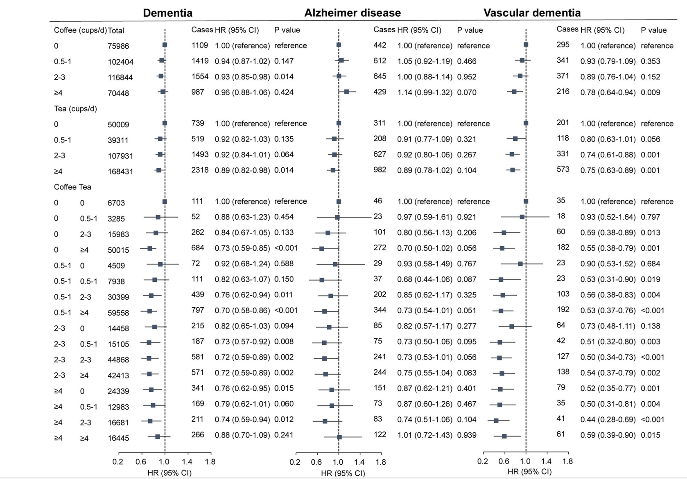
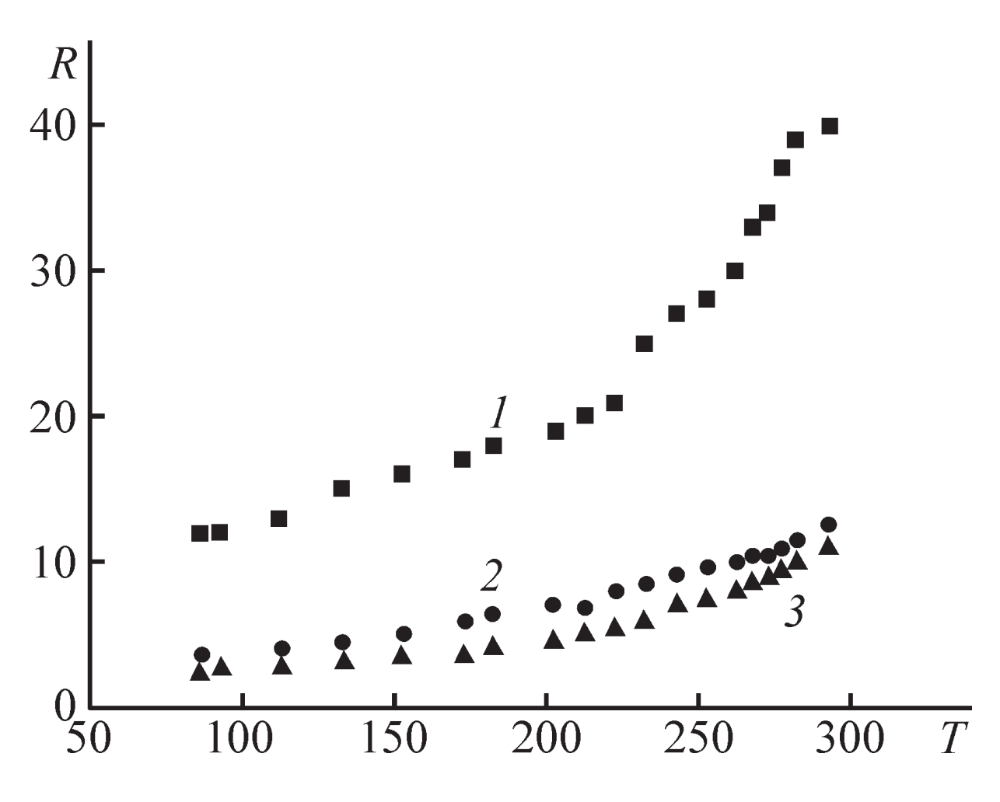

# Примеры статей

## Разведочный анализ

Целью разведочного анализа является изучение данных и поиск взаимосвязей между данными для дальнейшего изучения.

В качестве примера статьи содержащей использование данного вида анализа используется статья Consumption of coffee and tea and risk of
developing stroke, dementia, and poststroke
dementia: A cohort study in the UK Biobank (<https://www.researchgate.net/publication/356268691_Consumption_of_coffee_and_tea_and_risk_of_developing_stroke_dementia_and_poststroke_dementia_A_cohort_study_in_the_UK_Biobank>). В данной статье рассматривается влияние потребления чая и кофе на риск появления деменции и инсульта. 

Фрагмент одной из таблиц статьи приведён ниже:

|                |Coffee intake, cups/day, No. (%)|      |         |                 |      Tea intake, cups/day, No. (%)  | | |                             |
|:--------------:|:--------------:|:---------------:|:---------------:|:--------------:|:--------------:|:--------------:|:---------------:|:---------------:|
| Characteristic |  0             | 0.5 to 1        | 2 to 3          | >=4            |   0            |  0.5 to 1      |  2 to 3         |   >4            |
| No. (%)        | 75,986 (20.78) | 102,404 (28.00) | 116,844 (31.95) | 70,448 (19.26) | 50,009 (13.68) | 39,311 (10.75) | 107,931 (29.51) | 168,431 (46.06) |
|Age, mean (SD), y| 59.99 (5.25)| 60.71 (5.16)| 60.71 (5.12)| 60.17 (5.14)| 60.04 (5.16)| 60.18 (5.21)| 60.59 (5.17)| 60.55 (5.15)|
|Coffee intake, mean (SD)| 0 0.87 (0.22)| 2.39 (0.49)| 5.20 (1.59)| 3.53 (2.49)| 2.83 (2.01)| 2.00 (1.61)| 1.37 (1.59)|
|Tea intake, mean (SD)| 4.60 (2.77)| 4.10 (2.34)| 3.02 (2.22)| 2.03 (2.42)| 0 |0.87 (0.22)| 2.52 (0.50)| 5.69 (1.91)|

Фрагмент таблицы приведёно просто потму, что нужно вставить таблицу в документ.

Результат исследования приведён на графике.

В статье проводится ряд последовательных исследований, включая пункт с названием "Статистический анализ". К концу происходит более точное и выраженное численно соотношение между потреблением вышеупомянутых напитков на риск вышеупомянутых болезней, однако в начале описываются первые этапы исследования, включающие и разведочный анализ.

    
## Механистический анализ

Цель механистического анализа - точно выяснить как изменение одних переменных влияет на изменение других переменных.

Примером статьи с механистическим анализом "ПРОВОДЯЩИЕ СВОЙСТВА ПЛЕНОК КОМПОЗИТА ОКСИДА ГРАФЕНА
НА ОСНОВЕ ПОЛИСТИРОЛА В СТРУКТУРАХ МЕТАЛЛ–ПОЛИМЕР–МЕТАЛЛ" (<https://elibrary.ru/download/elibrary_42902624_18075997.pdf>). Авторы статьи:   М.Н.Николаева, А.Н.Бугров, Т.Д.Ананьева, А.Т.Дидейкин. В данной работе описывается создание материала с высокой проводимостью.

>Целью данной работы было создание полимерного
композитного материала, обладающего высокой
проводимостью за счет изменения его химической
и физической структуры.

Кроме создания материала необходима его точная оценка сопротивления в зависимости от состава. Данная зависимость сопротивления от температуры на разных материалах отображена на графике статьи.

{width=400px}

Данное исследование

1. Исследует точное изменение одних переменных от других,
1. Применяется в физической/инженерной науке,
1. Имеет вывод, выражающийся в точном сравнении одних переменных от других.
  
>Пленки полученного композита в структурах металл–полимер–металл имеют величину проводящего слоя hmax
выше на 1.5 порядка, чем hmax для пленок чистого
полистирола и пленок, полученных в результате механического смешивания полистирола с 3-(триметоксисилил)пропилметакрилатом и оксидом графена.

В итоге данная статья предположительно содержит механистический анализ.

Ссылка на Github:
<https://github.com/DmitriyKosogorov/R_Markdown_test.git>

